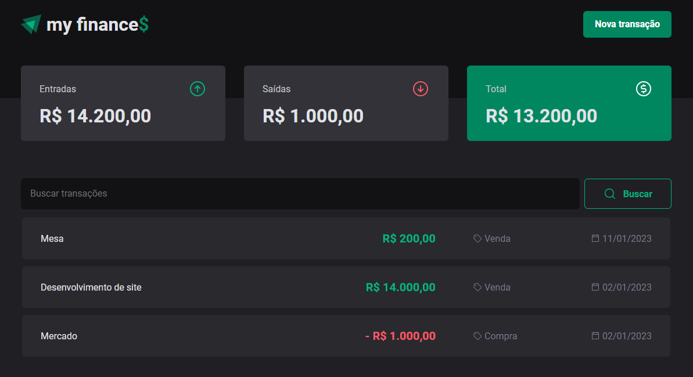

<h1 align="center">my finance$ 2.0 💸</h1>

  

 
<h2>💵 Sobre</h2>

Projeto desenvolvido durante o 3º módulo do bootcamp Ignite da Rocketseat. A aplicação permite que o usuário registre operações financerias em uma tabela, separando entre ganhos e despesas, obtendo um controle maior sobre suas finanças. Este projeto é uma versão atualizada do projeto <a href="https://github.com/Matheus-Pazinati/my-finances" target="_black">my finances.</a>

 
<h2>🎯 Objetivo</h2>

Este módulo do Ignite teve como foco principal entender tanto na teoria quanto na prática dois assuntos muito relevantes na área de desenvolvimento web (especialmente Front-end): Buscar dados através de uma API, utilizando requisições HTTP (GET, POST, PUT, DELETE), enviando parâmetros, e criar a interface com base nesses dados e Perfomance no React: quais recursos a biblioteca disponibiliza para lidarmos com performance (memo, useMemo, useCallback), qual o fluxo de renderização dos componentes do React, como identificar gargalos de performance e como soluciona-los.

 
<h2>🛠️ Tecnologias e ferramentas/bibliotecas utilizadas</h2>
<ul>
  <li><a href="https://pt-br.reactjs.org/">React</a></li>
  <li><a href="https://www.typescriptlang.org/">Typescript</a></li>
  <li><a href="https://styled-components.com/">Styled-Components</a></li>
  <li><a href="https://react-hook-form.com/">React Hook Form</a></li>
  <li><a href="https://github.com/colinhacks/zod">zod</a></li>
  <li><a href="https://axios-http.com/ptbr/docs/intro">axios</a></li>
  <li><a href="https://github.com/dai-shi/use-context-selector">context-selector</a></li>
  <li><a href="https://github.com/typicode/json-server">json-server</a></li>
</ul>
 
<h2>💻 Como rodar o projeto</h2>
<ol>
  <li>Faça fork ou baixe o projeto em sua máquina</li>
  <li>Entre na pasta raíz do projeto, e execute o comando npm install no terminal, para baixar as dependências</li>
  <li>Execute o comando npm run dev:server, que irá subir o arquivo JSON localmente (porta 3333), simulando uma API</li>
  <li>Execute o comando npm run dev, para subir a aplicação (front-end) no localhost</li>
</ol>
 
<h2>📌 Funcionalidades a serem implementadas</h2>
<ul>
  <li>Incluir um botão em cada transação registrada, para excluir mesma - Ok ✔️</li>
  <li>Incluir um botão no campo de busca para limpar e cancelar a mesma - Ok ✔️</li>
</ul>
 
<h2>🔖 Layout</h2>

Você pode visualizar o layout do projeto através deste link: <a href="https://www.figma.com/community/file/1138814493269096792">Layout do projeto</a>. É necessário possuir uma conta no <a href="https://figma.com">Figma</a> para acessá-lo.

 
 

Made by Matheus Pazinati 🛸
